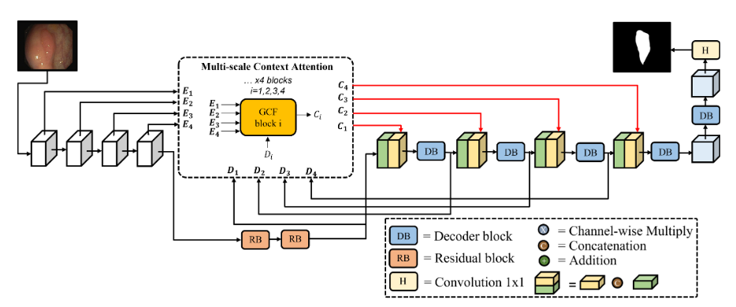
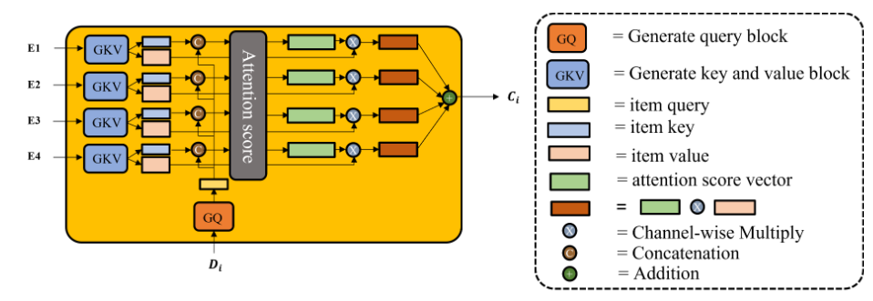
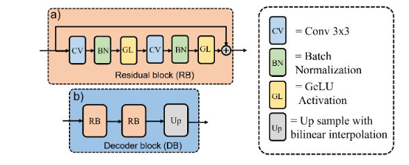
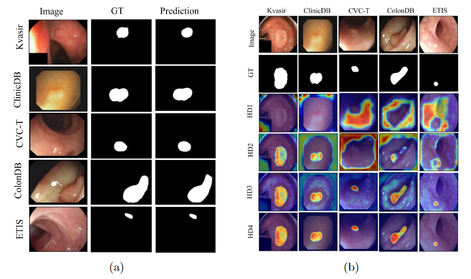

# CTDCFormer
A Multi Context Decoder-based Network with Applications for Polyp Segmentation in Colonoscopy Images (CITA 2023 paper)

Authors: [Ngoc-Du Tran](), [Dinh-Quoc-Dai Nguyen](), [Ngoc-Linh-Chi Nguyen](), [Van-Truong Pham](https://scholar.google.com/citations?user=8vX7c-cAAAAJ&hl=en) and [Thi-Thao Tran](https://scholar.google.com/citations?user=NX-jgPcAAAAJ&hl=en)

Links to the paper:
+ [Springer](https://link.springer.com/chapter/10.1007/978-3-031-36886-8_13)


## 1. Overview

### 1.1 Abstract
Polyp Segmentation is important in helping doctors diagnose and provide an accurate treatment plan. With the emerging of deep learning technology in the last decade, deep learning models especially  Unet and its evolved versions, for medical segmentation task have achieved superior results compared to previous traditional methods. To preserve location information, Unet-based models use connections between feature maps of the same resolution of encoder and decoder. However, using the same resolution connections has two problems: 1) High-resolution feature maps on the encoder side contain low-level information. In contrast, high-resolution feature maps on the decoder side contain high-level information that leads to an imbalance in terms of semantic information when connecting. 2) In medical images, objects such as tumours and cells often have diverse sizes, so to be able to segment objects correctly, the use of context information on a scale of the feature map encoder during the decoding process is not enough, so it is necessary to use context information on full-scale. In this paper, we propose a model called CTDCFormer that uses the PvitV2\_B3 model as the backbone encoder to extract global information about the object. In order to exploit the full-scale context information of the encoder, we propose the GCF module using the lightweight attention mechanism between the decoder's feature map and the encoder's four feature maps. Our model CTDCFormer achieves superior results compared to other state of the arts, with the Dice scores up to 94.1\% on the Kvasir-SEG set, and  94.7\% on the CVC-ClinicDB set.

### 1.2 Architecture
<p align="center">
	 <br />
	<em>
		Figure 1: Overview Architecture of the proposed CTDCFomer model.
	</em>
</p>

<p align="center">
	 <br />
	<em>
		Figure 2: Structure of the proposed GCF module.
	</em>
</p>

<p align="center">
	 <br />
	<em>
		Figure 4: Structure of a) Residual block (RB), and b) Decoder Block (DB)
	</em>
</p>

### 1.3 Qualitative results
<p align="center">
	 <br />
	<em>
		Figure 5: Qualitative segmentation results of the proposed CTDCFormer model. a) The predicted results on 5 datasets. b) Attention heatmaps of four decoder layers connected to GCF module module ($HD_i$ is the heatmap of the ith decoder layer)
	</em>
</p>

## 2. Usage
### 2.1 Preparation
+ Clone the repository and navigate to directory:
```
git clone https://github.com/tranngocduvnvp/CTDCFormer.git
cd ./CTDCFormer
```
+ Download and extract the [Kvasir-SEG](https://datasets.simula.no/downloads/kvasir-seg.zip) and the [CVC-ClinicDB](https://polyp.grand-challenge.org/CVCClinicDB/) datasets.

### 2.2 Training

```
python train.py
```
Enter arguments for args variable in file train.py

### 2.3 Evaluation
```
python eval.py
```
Enter arguments for args variable in file eval.py, replace `[checkpoint_path]` with path to checkpoint of model was trained.

### 2.4 Visualization
```
python visualization.py
```

## 3. Citation
If you use this work, please consider citing us:
```bibtex
@inproceedings{tran2023multi,
  title={A Multi Context Decoder-based Network with Applications for Polyp Segmentation in Colonoscopy Images},
  author={Tran, Ngoc-Du and Nguyen, Dinh-Quoc-Dai and Nguyen, Ngoc-Linh-Chi and Pham, Van-Truong and Tran, Thi-Thao},
  booktitle={Conference on Information Technology and its Applications},
  pages={157--168},
  year={2023},
  organization={Springer}
}
```
## 4. Acknowledgment
This research is funded by Vietnam National Foundation for Science and Tech-
nology Development (NAFOSTED) under grant number 102.05-2021.34.